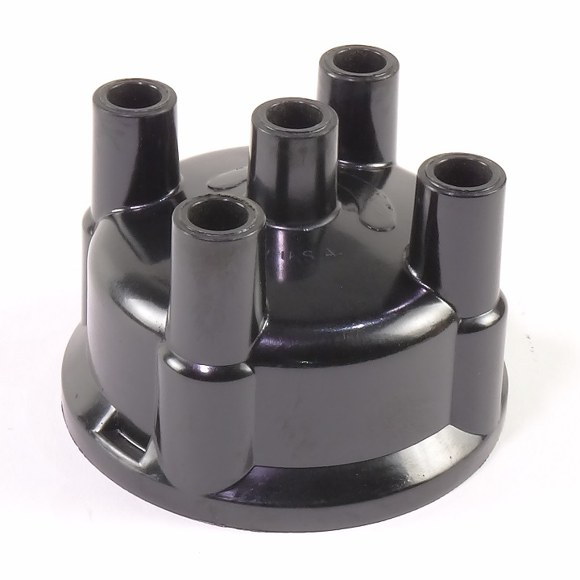

===========
Distributor
===========

Proof-of-concept code for distributing spectroscopic data.

Docker Notes
------------

::

    docker run --rm --name distributor-app -e DESI_SPECTRO_REDUX=/opt/app/desi/spectro/redux -e SPECPROD=mini -v ${HOME}/Documents/Data/desi/datachallenge/reference_runs/18.3:/opt/app/desi:ro -p 56789:56789 distributor-app:latest
